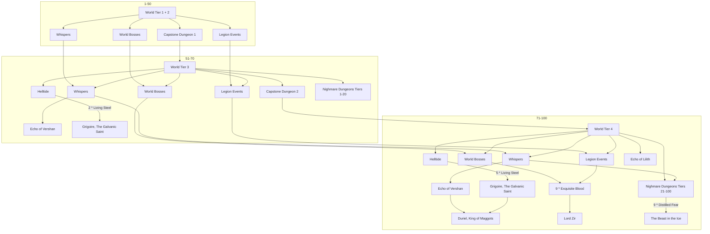

# Diablo 4: Bosses

## Progression

## Bosses and Items

### Template

- Barbarian
- Druid
- Necromancer
- Rogue
- Sorcerer
- All Classes
- Über Uniques

### Beast in Ice

- Barbarian
  - Fields of Crimson
  - 100000 Steps
  - Ancients' Oath
  - Battle Trance
  - Hellhammer
- Druid
  - Insatiable Fury
  - Hunter's Zenith
  - Waxing Gibbous
  - Storm's Companion
- Necromancer
  - Bloodless Scream
  - Howl from Below
  - Deathspeaker's Pendant
  - Ring of Mendeln
- Rogue
  - Condemnation
  - Word of Hakan
  - Windforce
  - Eaglehorn
- Sorcerer
  - Staff of Lam Esen
  - Esu's Heirloom
  - Gloves of the Illuminator
  - The Oculus
- All Classes
  - Frostburn
  - Mother's Embrace
  - Fists of Fate
  - Tassets of the Dawning Sky

### Duriel

- Barbarian
  - Azurewrath
  - Tuskhelm of Joritz the Mighty
- Druid
  - Dolmen Stone
  - Tempest Roar
- Necromancer
  - Black River
  - Blood Moon Breeches
- Rogue
  - Cowl of the Nameless
  - Scoundrel's Leathers
- Sorcerer
  - Blue Rose
  - Flamescar
- All Classes
  - Banished Lord's Talisman
  - Flickerstep
  - Godslayer Crown
  - Soulbrand
  - Tibault's Will
  - X'Fal's Corrodet Signet
- Über Uniques
  - Ahavarion, Spear of Lycander (Druid, Sorcerer)
  - Andariel's Visage
  - Doombringer (Barb, Necro, Rogue)
  - Harlequin Crest
  - Melted Heart of Selig
  - Ring of Starless Skies
  - The Grandfather (Barb, Necro)

### Grigiore

- Barbarian
  - Ramaladni's Magnum Opus
  - Rage of Harrogath
  - Ancients' Oath
  - Battle Trance
  - The Butcher's Cleaver
- Druid
  - Insatiable Fury
  - Hunter's Zenith
  - Waxing Gibbous
  - The Butcher's Cleaver
- Necromancer
  - Blood Artisan's Cuirass
  - Howl from Below
  - Greaves of the Empty Tomb
- Rogue
  - Word of Hakan
  - Grasp of Shadow
  - Windforce
- Sorcerer
  - Staff of Lam Esen
  - Iceheart Brais
  - Gloves of the Illuminator
- All Classes
  - Penitent Greaves

### Lord Zir

- Barbarian
  - Ramaladni's Magnum Opus
  - Rage of Harrohatg
  - Gohr's Devasting Grips
  - Overkill
  - The Butcher's Cleaver
- Druid
  - Mad Wolf's Glee
  - Vasily's Prayer
  - Greatstaff of the Crone
  - Fleshrender
  - The Butcher's Cleaver
- Necromancer
  - Blood Artisan's Cuirass
  - Deathless Visage
  - Greaves of the Empty Tomb
  - Lidless Wall
- Rogue
  - Grasp of Shadow
  - Eyses in the Dark
  - Skyhunter
  - Asheara's Khanjar
- Sorcerer
  - Staff of Endless Rage
  - Icehear Brais
  - Raiment of the Infinite
  - Esadora's Overflowing Cameo
- All Classes
  - Penitent Greaves
  - Razorplate
  - Temerity

### Varshan

- Barbarian
  - 100000 Steps
  - Fields of Crimson
  - Gohr's Devasting Grips
- Druid
  - Greatstaff of the Crone
  - Mad Wolf's Glee
  - Vasily's Prayer
- Necromancer
  - Bloodless Scream
  - Deathless Visage
  - Deathspeaker's Pendant
- Rogue
  - Condemnation
  - Eyes in the Dark
  - Skyhunter
- Sorcerer
  - Esu's Heirloom
  - Raiment of the Infinite
  - Staff of Endless Rage
- All Classes
  - Frostburn
  - Mother's Embrace
