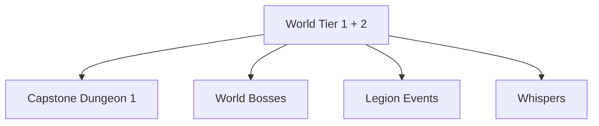
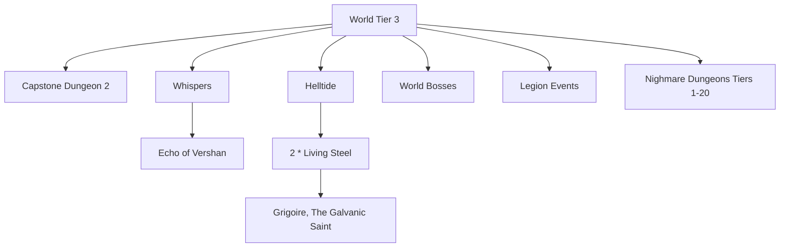
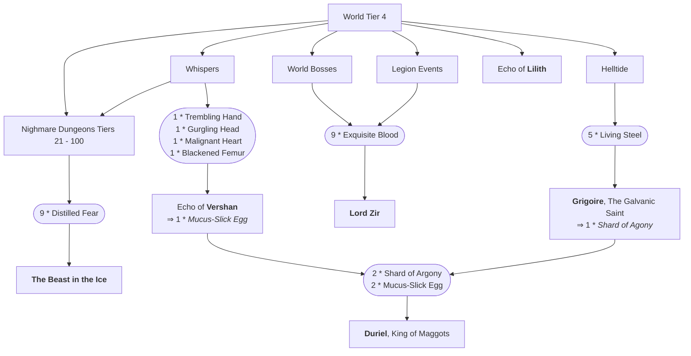

# Progression

## Level 1 - 50

```mermaid
flowchart TB

    WT12[World Tier 1 + 2]
    CD1[Capstone Dungeon 1]
    WS12[Whispers]
    WB12[World Bosses]
    LE12[Legion Events]

    WT12-->CD1
    WT12-->WB12
    WT12-->LE12
    WT12-->WS12

```

## Level 51 - 70

```mermaid
flowchart TB

    WT3[World Tier 3]
    CD2[Capstone Dungeon 2]
    WS3[Whispers]
    HT3[Helltide]
    WB3[World Bosses]
    LE3[Legion Events]
    NM3[Nighmare Dungeons Tiers 1-20]
    EV3[Echo of Vershan]
    GT3[Grigoire, The Galvanic Saint]
    LS2[2 * Living Steel]

    WT3-->CD2
    WT3-->NM3
    WT3-->WB3
    WT3-->LE3
    WT3-->WS3
    WT3-->HT3

    WS3-->EV3
    HT3-->LS2
    LS2-->GT3
```

## Level 71 - 100

```mermaid
flowchart TB
    WT4["World Tier 4"]
    WS4["Whispers"]
    HT4["Helltide"]
    WB4["World Bosses"]
    LE4["Legion Events"]
    NM4["Nighmare Dungeons Tiers 21 - 100"]
    EV4["`Echo of **Vershan**
         ⇒ 1 * _Mucus-Slick Egg_`"]
    DU4["`**Duriel**, King of Maggots`"]
    GT4["`**Grigoire**, The Galvanic Saint
         ⇒ 1 * _Shard of Agony_`"]
    LZ4["`**Lord Zir**`"]
    BI4["`**The Beast in the Ice**`"]
    EL["`Echo of **Lilith**`"]

    TWI(["1 * Trembling Hand
          1 * Gurgling Head
          1 * Malignant Heart
          1 * Blackened Femur"])
    EB9(["9 * Exquisite Blood"])
    LS5(["5 * Living Steel"])
    DF9(["9 * Distilled Fear"])
    EGS(["2 * Shard of Argony
          2 * Mucus-Slick Egg"])

    WT4-->WS4
    WT4-->NM4
    WT4-->HT4
    WT4-->WB4
    WT4-->LE4
    WT4-->EL

    HT4-->LS5
    LS5-->GT4

    WB4-->EB9
    LE4-->EB9
    EB9-->LZ4

    WS4-->TWI
    TWI-->EV4

    WS4-->NM4

    NM4-->DF9
    DF9-->BI4

    EV4-->EGS
    GT4-->EGS
    EGS-->DU4
```
